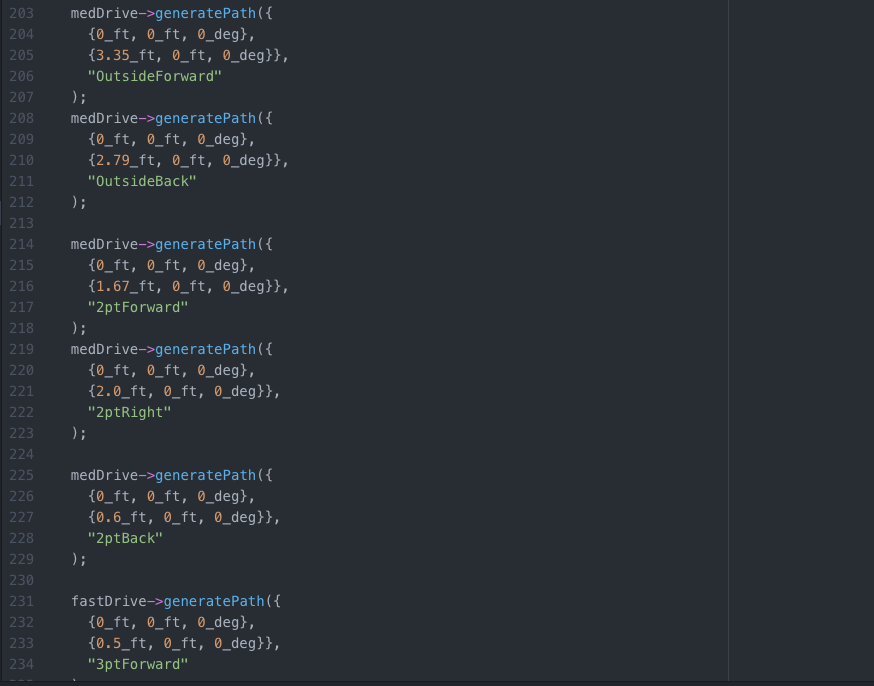
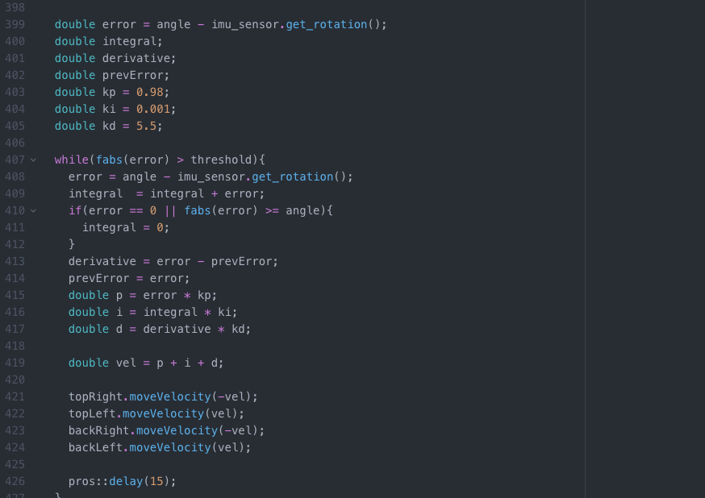
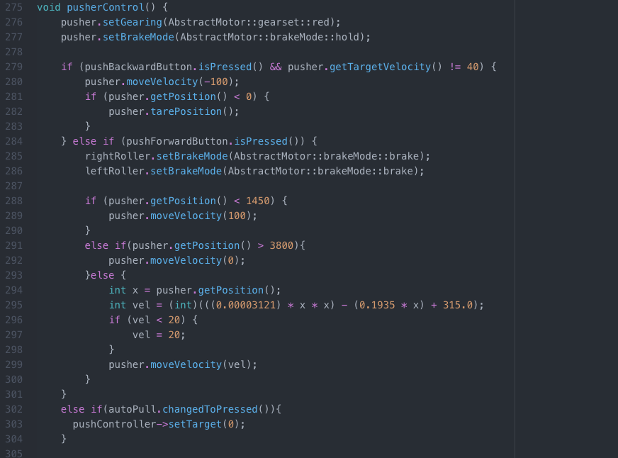

# VEX-Tower-Takeover
My 2019-20 year of VEX Robotics saw more experience with more advanced code techniques and methodologies. The code in this repo shows off the programming that went into our robot for Tower Takeover. We switched to PROS this year and made use of the Okapilib to (hopefully) get a smoother and more accurate autonomous routine. With techniques such as motion profiling and odometry, our robot began to win more auton points and make our way into semifinals at States. 

The descriptions below outline some fancy features I did to make our bot perform better. 

## 2D Motion Profiling

The OkapiLib has functionality for 2D Motion Profiling. Essentially, you can imagine the VEX field as a 2D coordinate plane and tell your bot to move to certain coordinates, and the methods will automatically calculate the motions neccessary to get there. It also allows for curvilinear motion, which is the coolest thing I've ever seen.

## LVGL Library

To prevent having to reupload auton code for different sides of the field, I made a auton selector with the Little vGL library. This way, drive team can just select the auton they want right before the match starts. Plus, it looks so cool..

## V5 Inertial Sensor and PID

We somehow got to mess with the new V5 Inertial Sensor. With its crazy accuracy, our turning angles became monumentally precise. To complement the sensor, I made a PID (proportional, intergral, and derivative) controller to make turning astronomically consistent. In a nutshell, the bot calculates the angle left to turn as it turns (known as the error) and slows changes its speed proporional to that angle, so it slows down as it reaches its target. 

## Parabolic Stacking

Stacking was a huge part of this game. Going too fast could knock down the cubes and going too slow was just took too much time. I made the pusher motor move as a function of the motor's encoder position so that it follows parabolic behavior. Essentially, it slows down as it goes forward, getting the best of both worlds.

